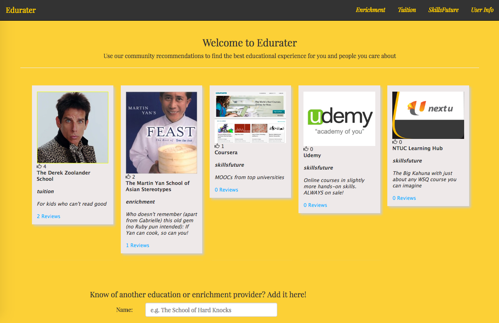
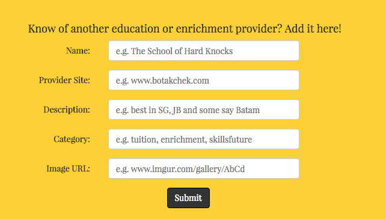
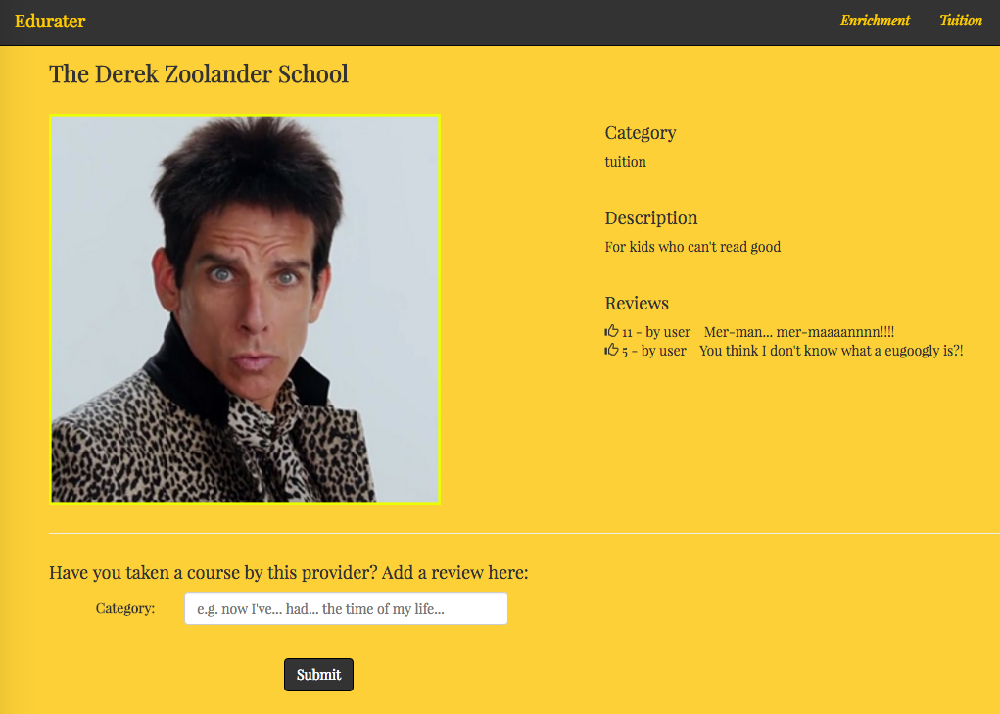

# Edurater: A community resource for discovering and rating education programs (for a start, in Singapore)

### Overview

[Edurater](https://github.com/khoodose/ratedgold) is a MEAN stack web app that allows users to list and rate education providers whose services they have used.  Site visitors can use the listings as a resource for discovery or social proof of a provider's value.  They can upvote and add comments on existing listings.  In so doing, it is hoped the community can have a useful shared resource.

I created Edurater as my 4th project for the General Assembly Web Development Immersive in Singapore (WDI-SG-2).  It was inspired by my work in the educaiton industry, and my sense that there was a growing need for people of all ages to keep learning and an overwhelming number of educational providers but limited curation.  Education is also an industry where referrals, word of mouth and social proof count for much, and where "built it and they will come" is not quite sufficient.

I hope you'll enjoy using this app! :)

~ [KT](https://github.com/khoodose)

### Technologies Used
- Mongoose
- MongoDB
- Express
- Angular
- Node.js
- Bootstrap and Masonry for CSS Styling

### Approach Taken
- I considered the main types of education providers in existence and tried to categorize them
- I reflected on existing sites that attempt to aggregate education providers in Singapore.  These include:
    - [Kiasuparents](http://www.kiasuparents.com/kiasu/)
    - [The Asian Parent](http://sg.theasianparent.com/)
    - Other random sites I stumbled upon when researching summer camp opportunities
- I weighed the different technology stacks we had gone over during the course and decided to have a go at a MEAN stack application instead of using Rails again (and regretted my decision at times)
- I looked up some tutorials on Angular 1, which I found a little easier to grasp than Angular 2, which was still relatively new
- The project gave me a useful overview and recap of:
    - How to set up an API, including restful routes and what to return
    - Making AJAX calls and creating a smoother user experience through ditching unnecessary page loads
    - Other CSS libraries apart from Bootstrap (Masonry) that can create nice stylish effects
    - Using some of the more powerful features of Angular like ordering and filtering to easily display selections from the overall array of providers stored in the backend
    - The relative strengths of Rails and Node.js, at least as it concerns handling file uploads and multiple database relationships (advantage: Rails) and quick prototyping and changing of database schemas (advantage: Node)

### Usage Instructions
- Users can view all the providers that the community has listed and reviewed on the home page, and can also make use of the filters in the navigation bar to view only providers who belong to a particular category.  For now these are:
    - Enrichment
    - Tuition
    - Skills Future (a Singapore government framework for incentivizing labour skills upgrades)

- Users can also add providers to the database with the form at the bottom of the home page.

- Upon seeing any provider that piques their interest, users can click on the provider's tile and be taken to that provider's profile page for more information, which will look something like this:

- Users can then add their own reviews of the provider and also vote on earlier reviews.

### Future Development
- Social logins and referrals
    - Users can be authenticated through Facebook/Twitter/Google logins, which will also allow them to share their posted providers and reviews more easily
    - Visitors to the site will be able to see the posts and upvotes their friends on social media have made
- New categories
    - The enrichment category, for example, could be split up into things like sports, the arts, cooking etc.
- Edurater goes regional or global
    - The database can be extended to reflect which country a course is available in, which may be useful for cross-country comparisons and also allow people to consider taking courses in nearby countries
    - MOOCs might be classified as purely global or not restricted to any particular country
- Scheduling
    - Users may be able to use a calendar to schedule an appointment or consultation with the listed providers, though this will require merchant accounts and logins too
